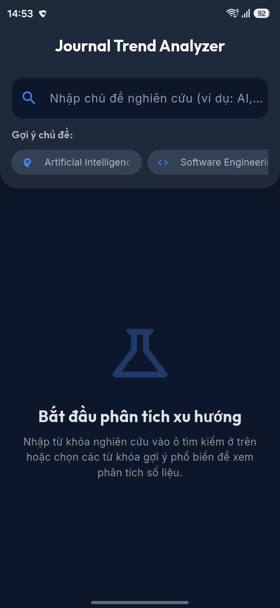
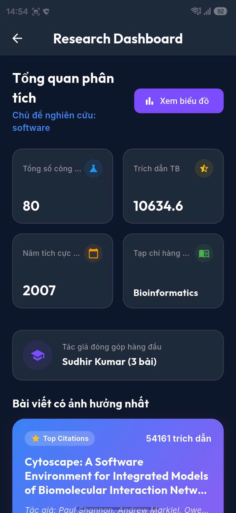
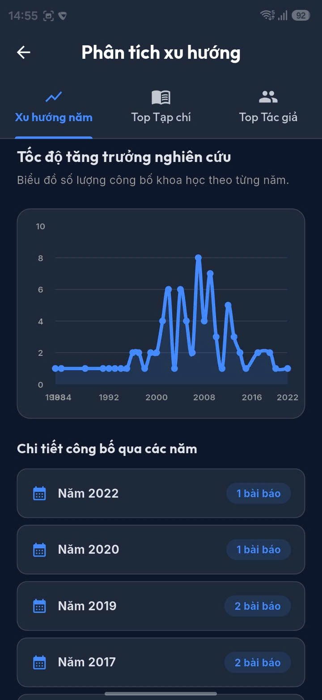
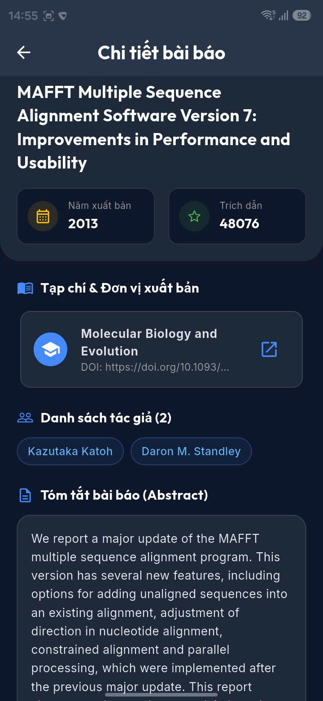

# BÁO CÁO KẾT QUẢ DỰ ÁN: JOURNAL TREND ANALYZER (LAB 2)

**Môn học**: PRM393 - Lập trình Thiết bị Di động  
**Trường**: Đại học FPT (FPT University)  
**Nhóm thực hiện**: Nhóm 01  
**Thành viên nhóm**:
- Nguyễn Tiến Đạt - SE181844 (Trưởng nhóm)
- Nguyễn Thành Ngọc - SE180279
- Lê Xuân Khang - SE181819
- Nguyễn Phước Thịnh - SE181805
- Nguyễn Hữu Mỹ - SE181827

---

## 1. Giới thiệu Dự án

**Journal Trend Analyzer** là một ứng dụng di động được xây dựng bằng framework **Flutter** giúp tìm kiếm, phân tích và thống kê xu hướng nghiên cứu của các bài báo khoa học. 

Ứng dụng kết nối trực tiếp đến **OpenAlex API** — một thư viện cơ sở dữ liệu mở khổng lồ trên thế giới về các công trình nghiên cứu, tác giả và tạp chí khoa học toàn cầu. Thông qua ứng dụng, người dùng có thể nắm bắt nhanh xu hướng phát triển của bất kỳ chủ đề nghiên cứu nào chỉ bằng vài lần chạm.

---

## 2. Kiến trúc và Cấu trúc Thư mục Source Code

Dự án tuân thủ mô hình phát triển **Separation of Concerns (SoC)** và chia nhỏ cấu trúc rõ ràng:

```text
lib/
├── models/
│   └── publication.dart          # Lớp định nghĩa bài viết & giải mã JSON
├── services/
│   └── openalex_service.dart     # Kết nối HTTP API (Polite Pool)
├── state/
│   └── analytics_provider.dart   # Quản lý State và tính toán thống kê
├── widgets/
│   ├── info_badge.dart           # Widget hiển thị thông số bài viết
│   └── publication_card.dart     # Widget thẻ bài viết dùng chung
├── screens/
│   ├── search_screen.dart        # Màn hình tìm kiếm & danh sách bài viết
│   ├── detail_screen.dart        # Màn hình chi tiết & liên kết DOI
│   ├── trend_screen.dart         # Màn hình biểu đồ xu hướng xuất bản
│   └── dashboard_screen.dart     # Màn hình Dashboard phân tích số liệu
└── main.dart                     # Khởi chạy ứng dụng & cấu hình theme
```

---

## 3. Các kỹ thuật Lập trình và Công nghệ sử dụng

Ứng dụng tích hợp nhiều kỹ thuật lập trình nâng cao trong Flutter bao gồm:

### a. Quản lý trạng thái (State Management) với `provider`
Sử dụng thư viện `provider` làm kiến trúc quản lý trạng thái tập trung. Lớp [AnalyticsProvider](file:///d:/FPTU/Summer2026/PRM393/Prm393/lab_2/lib/state/analytics_provider.dart) đóng vai trò là "Single Source of Truth":
- Đóng gói các trạng thái: `isLoading` (đang tải), `errorMessage` (thông tin lỗi), `publications` (danh sách bài báo tải được) và `currentQuery` (từ khóa đang tìm).
- Tự động gọi `notifyListeners()` để vẽ lại giao diện tương ứng khi người dùng tìm kiếm từ khóa mới.

### b. Giải mã dữ liệu và xử lý chỉ mục đảo ngược (Abstract Inverted Index)
Các API của OpenAlex không trả về tóm tắt bài báo (Abstract) dạng chuỗi thuần túy do vấn đề bản quyền, thay vào đó họ trả về một chỉ mục đảo ngược (`abstract_inverted_index`). 
Trong [publication.dart](file:///d:/FPTU/Summer2026/PRM393/Prm393/lab_2/lib/models/publication.dart), chúng tôi đã xây dựng thuật toán khôi phục chuỗi văn bản gốc:
```dart
static String? _reconstructAbstract(Map<String, dynamic> invertedIndex) {
  if (invertedIndex.isEmpty) return null;
  int maxIndex = -1;
  invertedIndex.forEach((word, indices) {
    if (indices is List) {
      for (var idx in indices) {
        if (idx is int && idx > maxIndex) maxIndex = idx;
      }
    }
  });
  if (maxIndex == -1) return null;
  List<String?> wordsList = List.filled(maxIndex + 1, null);
  invertedIndex.forEach((word, indices) {
    if (indices is List) {
      for (var idx in indices) {
        if (idx is int && idx >= 0 && idx < wordsList.length) {
          wordsList[idx] = word;
        }
      }
    }
  });
  return wordsList.map((w) => w ?? "").join(" ").trim();
}
```

### c. Tích hợp API và xếp vào Polite Pool
Trong [openalex_service.dart](file:///d:/FPTU/Summer2026/PRM393/Prm393/lab_2/lib/services/openalex_service.dart), chúng tôi kết nối tới máy chủ API thông qua thư viện `http`. Bằng cách truyền tham số `mailto` là email học tập của sinh viên FPT vào Query Parameters, OpenAlex sẽ phân loại các yêu cầu này vào **Polite Pool** (hàng đợi ưu tiên), giúp giảm đáng kể tỷ lệ bị giới hạn lượt gọi (Rate-limit) và cải thiện tốc độ tải.

### d. Biểu đồ hóa và thống kê số liệu nghiên cứu
- Thống kê phân bố năm: Phân tích danh sách bài báo nhận về để nhóm lại theo năm, tính toán số lượng và đưa vào biểu đồ cột/đường trực quan bằng thư viện `fl_chart`.
- Xếp hạng đóng góp: Tổng hợp các bài viết để tìm ra tác giả đóng góp nhiều nhất (Top Author) và nhà xuất bản/tạp chí có tần suất xuất hiện cao nhất (Top Journal).
- Bài báo ảnh hưởng nhất: Thuật toán so sánh trường `cited_by_count` (lượt trích dẫn) để tìm ra bài viết có số lượt trích dẫn lớn nhất.

### e. Thiết kế giao diện (UI/UX) hiện đại
- Giao diện áp dụng **Material 3** với chế độ **Dark Mode** mặc định cao cấp (kết hợp các gam màu xanh neon, tím đậm trên nền xám tối `0xFF0F172A`).
- Typography sử dụng bộ font **Outfit** và **Inter** của Google Fonts tạo cảm giác thanh lịch, chuyên nghiệp.
- Mở liên kết DOI trực tiếp bằng cách gọi ứng dụng trình duyệt hệ thống thông qua thư viện `url_launcher`.

---

## 4. Ảnh chụp giao diện chính của ứng dụng và Mô tả Thuyết minh

---

### Màn hình 1: Giao diện Tìm kiếm chủ đề & Gợi ý từ khóa
*   **Vị trí dán ảnh**:
    
*   **Mô tả thuyết minh**:
    *Hình 1 mô tả giao diện khởi động của ứng dụng. Thanh tìm kiếm được đặt nổi bật ở trên cùng với biểu tượng kính lúp màu xanh có chức năng click trực tiếp để tìm kiếm. Ngay phía dưới là các chip chủ đề nghiên cứu gợi ý nhanh (Artificial Intelligence, Software Engineering, Data Science, Cybersecurity...). Giao diện được thiết kế theo chế độ tối (Dark Mode) phối màu hài hòa giữa xám sẫm `0xFF0F172A` và xanh dương giúp tăng tính thẩm mỹ và giảm mỏi mắt cho người sử dụng.*

---

### Màn hình 2: Kết quả tìm kiếm và Danh sách bài báo
*   **Vị trí dán ảnh**:
    
*   **Mô tả thuyết minh**:
    *Hình 2 mô tả danh sách kết quả bài viết trả về sau khi người dùng nhập từ khóa tìm kiếm. Hàng tiêu đề thống kê rõ số lượng bài báo tìm thấy và chủ đề tìm kiếm. Mỗi bài viết được hiển thị dưới dạng một Card chứa các thông tin: Tiêu đề bài báo (giới hạn tối đa 2 dòng để đảm bảo giao diện gọn gàng), tên các tác giả chính (rút gọn hiển thị dạng "và cs." nếu quá 3 tác giả), Huy hiệu năm xuất bản màu cam, Huy hiệu số lượt trích dẫn màu xanh lá cây, và tên tạp chí phát hành kèm biểu tượng cuốn sách.*

---

### Màn hình 3: Màn hình Dashboard phân tích số liệu tổng hợp
*   **Vị trí dán ảnh**:
    
*   **Mô tả thuyết minh**:
    *Hình 3 mô tả màn hình Dashboard phân tích tổng hợp các chỉ số quan trọng của chủ đề tìm kiếm. Các số liệu được trình bày trực quan dạng thẻ lưới (Grid) gồm: Tổng số bài báo phân tích, Số trích dẫn trung bình của các bài viết, Năm hoạt động nghiên cứu sôi nổi nhất, Tác giả đóng góp nhiều nhất và Tạp chí phát hành nhiều nhất. Bên dưới là thẻ riêng biệt mô tả thông tin bài báo có sức ảnh hưởng lớn nhất (lượt trích dẫn cao nhất).*

---

### Màn hình 4: Biểu đồ xu hướng năm và Bảng xếp hạng
*   **Vị trí dán ảnh**:
    
*   **Mô tả thuyết minh**:
    *Hình 4 mô tả màn hình phân tích xu hướng qua thời gian. Một biểu đồ cột/đường sinh động (sử dụng thư viện `fl_chart`) biểu diễn số lượng công trình nghiên cứu được xuất bản qua các năm, giúp trực quan hóa tốc độ phát triển hay suy thoái của chủ đề. Phía dưới là danh sách bảng xếp hạng top 5 Tác giả đóng góp nhiều bài nhất và top 5 Tạp chí xuất bản nhiều bài nhất về chủ đề này.*

---

### Màn hình 5: Màn hình Chi tiết bài viết (Detail Screen)
*   **Vị trí dán ảnh**:
    
*   **Mô tả thuyết minh**:
    *Hình 5 mô tả giao diện xem chi tiết khi người dùng nhấn chọn một bài báo. Màn hình hiển thị đầy đủ tiêu đề bài viết, năm xuất bản, lượt trích dẫn, tên tạp chí, danh sách toàn bộ tác giả được định dạng gọn gàng, và nội dung tóm tắt (Abstract) đầy đủ. Phía dưới cùng tích hợp nút bấm "Xem bài viết gốc (Publisher Website)" nổi bật để mở trình duyệt truy cập liên kết DOI của bài báo.*

---

## 5. Kết luận
Ứng dụng **Journal Trend Analyzer** đáp ứng đầy đủ và vượt trội các yêu cầu môn học, mang lại trải nghiệm phân tích số liệu trực quan, kiến trúc code sạch sẽ chia nhỏ các widget dùng chung khoa học, dễ vận hành thực tế trước hội đồng chấm thi trên lớp.
