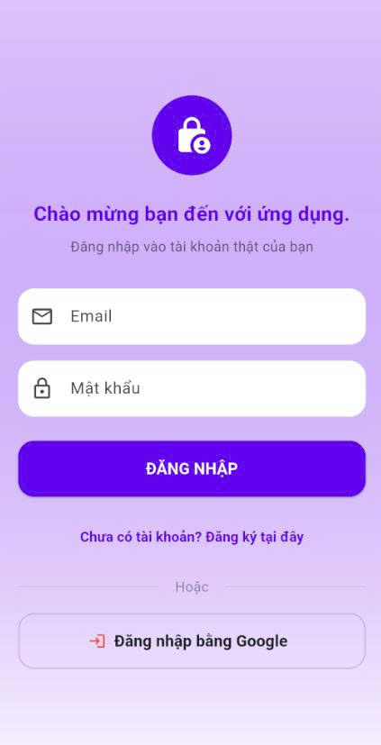
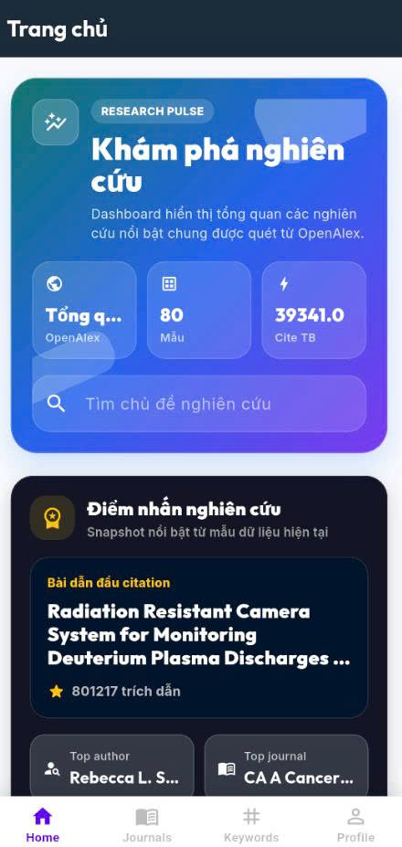
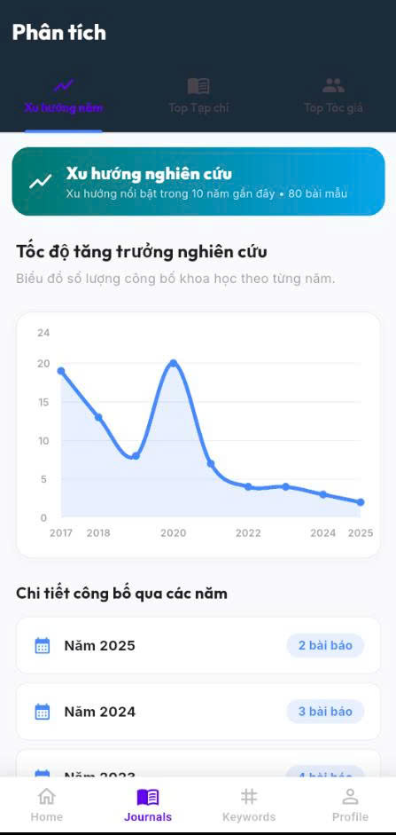
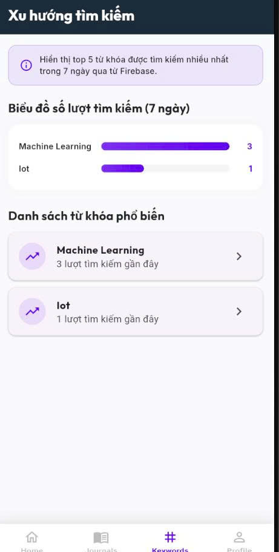
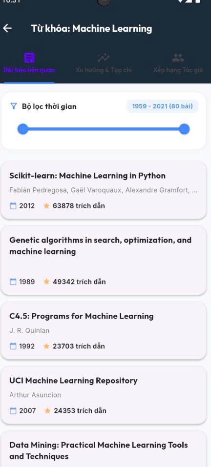
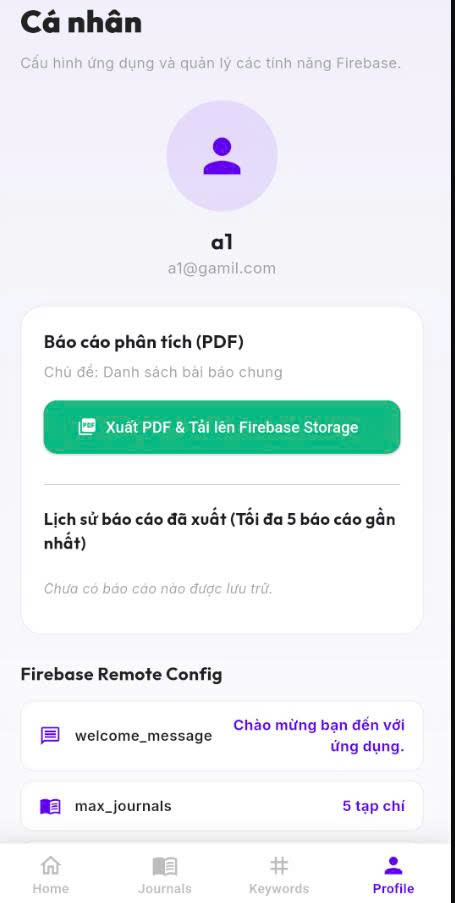

# BÁO CÁO KẾT QUẢ DỰ ÁN: RESEARCH ANALYTICS + FIREBASE (LAB 3)

**Môn học**: PRM393 - Lập trình Thiết bị Di động
**Trường**: Đại học FPT (FPT University)
**Nhóm thực hiện**: Nhóm 01
**Thành viên nhóm**:
- Nguyễn Tiến Đạt - SE181844 (Trưởng nhóm)
- Nguyễn Thành Ngọc - SE180279
- Lê Xuân Khang - SE181819
- Nguyễn Phước Thịnh - SE181805
- Nguyễn Hữu Mỹ - SE181827

---

## 1. Giới thiệu Dự án

**Lab 3** kế thừa ứng dụng phân tích bài báo khoa học **Journal Trend Analyzer (Lab 2)** và tích hợp **hệ sinh thái Firebase**, biến ứng dụng chỉ đọc dữ liệu công khai thành ứng dụng có tài khoản người dùng, dữ liệu đám mây, thông báo đẩy, cấu hình từ xa và giám sát lỗi. Nguồn dữ liệu học thuật vẫn là **OpenAlex API**.

| Dịch vụ Firebase | Vai trò | Nơi triển khai |
| :--- | :--- | :--- |
| **Authentication** | Đăng ký / Đăng nhập Email-Password và Google Sign-In | `login_screen.dart`, `main.dart` |
| **Cloud Firestore** | Lịch sử tìm kiếm, thông báo, DAU, lịch sử báo cáo PDF | `firestore_service.dart` |
| **Cloud Messaging** | Thông báo đẩy ở cả 3 trạng thái + tự gửi qua HTTP v1 API | `firebase_messaging_service.dart`, `fcm_sender_service.dart` |
| **Analytics** | 7 sự kiện hành vi: xem màn hình, tìm kiếm, nhấn nút, đăng nhập/xuất, xuất PDF | `firebase_analytics_service.dart` |
| **Crashlytics** | Bắt lỗi toàn cục Fatal / Non-fatal | `main.dart`, `profile_screen.dart` |
| **Remote Config** | Điều khiển màu, lời chào, giới hạn hiển thị từ xa realtime | `firebase_remote_config_service.dart` |
| **Storage** | Lưu báo cáo PDF, quản lý lịch sử, xóa tệp khỏi đám mây | `pdf_report_service.dart` |

---

## 2. Kiến trúc và Cấu trúc Thư mục Source Code

Dự án theo mô hình **MVVM (Model–View–ViewModel)** với **Provider** làm cơ chế state management, ánh xạ như sau:

| Tầng MVVM | Thư mục | Vai trò |
| :--- | :--- | :--- |
| **Model** | `models/` | `Publication`, `Author` — lớp dữ liệu thuần và parser JSON |
| **Service (Data)** | `services/` | Gọi OpenAlex API và 6 dịch vụ Firebase; không chứa logic giao diện |
| **ViewModel** | `viewmodels/` | `AnalyticsProvider` (trạng thái tìm kiếm + toàn bộ chỉ số thống kê, tự ghi lịch sử tìm kiếm lên Firestore), `AuthViewModel` (đăng nhập/đăng ký Email & Google, ánh xạ lỗi), `ProfileViewModel` (xuất PDF lên Storage, lịch sử báo cáo, thông báo, đăng xuất, kiểm thử Crashlytics) — đều là ChangeNotifier |
| **View** | `screens/`, `widgets/` | Quan sát ViewModel qua `context.watch` và chỉ render; các ViewModel được cấp phát qua `MultiProvider` trong `main.dart` |

Nguyên tắc *"business logic không nằm trong màn hình"* được tuân thủ: View gọi phương thức của ViewModel và nhận về kết quả (null = thành công, chuỗi = thông báo lỗi để hiển thị SnackBar); mọi lời gọi FirebaseAuth, Firestore, Storage, Crashlytics đều nằm trong tầng ViewModel/Service.

Cấu trúc thư mục:

```text
lib/
├── config/firebase_config.example.dart # Tệp mẫu khai báo khóa bí mật (bản thật bị .gitignore)
├── firebase_options.dart               # Cấu hình đa nền tảng sinh bởi FlutterFire CLI
├── models/                             # Publication, Author — lớp dữ liệu & parser JSON
├── services/                           # 7 service: OpenAlex + 6 service Firebase (bảng mục 1)
├── viewmodels/                         # Tầng ViewModel (MVVM)
│   ├── analytics_provider.dart         # Trạng thái tìm kiếm + tính toán thống kê
│   ├── auth_viewmodel.dart             # Nghiệp vụ đăng nhập / đăng ký
│   └── profile_viewmodel.dart          # Nghiệp vụ PDF, thông báo, đăng xuất, Crashlytics
├── widgets/                            # InfoBadge, PublicationCard — widget dùng chung
├── screens/
│   ├── login_screen.dart               # Đăng nhập / Đăng ký (Email & Google)
│   ├── main_navigation_screen.dart     # Khung điều hướng 4 tab + log screen_view
│   ├── home_screen.dart                # Tìm kiếm & Dashboard phân tích
│   ├── journals_screen.dart            # Xu hướng năm / Top Tạp chí / Top Tác giả
│   ├── keywords_screen.dart            # Xu hướng từ khóa tìm kiếm (Firestore)
│   ├── keyword_detail_screen.dart      # Chi tiết từ khóa & bộ lọc năm động
│   ├── journal_detail_screen.dart      # Chi tiết tạp chí
│   ├── publication_detail_screen.dart  # Chi tiết bài báo & liên kết DOI
│   ├── author_detail_screen.dart       # Chi tiết tác giả
│   └── profile_screen.dart             # Tài khoản, PDF, Remote Config, FCM, Crashlytics
└── main.dart                           # Khởi tạo Firebase, Crashlytics, định tuyến theo Auth
```

---

## 3. Các kỹ thuật Lập trình và Công nghệ sử dụng

**a. Định tuyến theo trạng thái xác thực** — `main.dart` dùng `StreamBuilder<User?>` lắng nghe `authStateChanges()`: chưa đăng nhập → `LoginScreen`, đã đăng nhập → `MainNavigationScreen`, giao diện tự chuyển không cần khởi động lại. Hỗ trợ Email/Password (kèm ánh xạ `FirebaseAuthException` sang tiếng Việt) và Google Sign-In.

**b. Bắt lỗi toàn cục Crashlytics** — gắn cả hai luồng lỗi ngay trong `main()`: `FlutterError.onError` (lỗi cây widget) và `PlatformDispatcher.instance.onError` (lỗi bất đồng bộ ngoài luồng giao diện).

**c. Remote Config realtime** — `FirebaseRemoteConfigService` kế thừa `ChangeNotifier` và lắng nghe `onConfigUpdated`; khi admin publish trên Console, service tự `activate()` rồi `notifyListeners()` — **giao diện đổi ngay không cần thao tác gì**:

```dart
_remoteConfig.onConfigUpdated.listen((event) async {
  await _remoteConfig.activate();
  notifyListeners();
});
```

Bốn khóa điều khiển từ xa: `welcome_message` (lời chào Đăng nhập), `primary_color` (màu chủ đạo toàn app), `max_journals` và `max_keywords` (giới hạn số dòng bảng xếp hạng, mặc định 5). `getPrimaryColor()` chuyển mã Hex sang `Color`, tự thêm kênh Alpha `FF` và fallback màu tím nếu sai định dạng.

**d. FCM ở cả ba trạng thái** — Foreground (`onMessage`, hiện SnackBar qua `GlobalKey<ScaffoldMessengerState>` toàn cục vì service không có `BuildContext`); Background (`onBackgroundMessage`, handler phải ở mức top-level và đánh dấu `@pragma('vm:entry-point')` để Dart VM gọi được khi app không hoạt động); Terminated (`getInitialMessage`). Thiết bị tự đăng ký topic `reminder_journal` khi khởi tạo, hủy khi đăng xuất.

**e. Tự gửi thông báo FCM HTTP v1** — `FcmSenderService` dùng `googleapis_auth` ký JWT bằng Private Key của Service Account, đổi lấy OAuth2 Access Token scope `firebase.messaging`, rồi POST tới `fcm.googleapis.com/v1/projects/{projectId}/messages:send` — gửi được ngay trong app, không cần vào Console.

**f. Mô hình Cloud Firestore** — 5 collection, mỗi bản ghi gắn `userId` để cô lập dữ liệu giữa các tài khoản:

| Collection | Nội dung | Ghi chú kỹ thuật |
| :--- | :--- | :--- |
| `search_history` | Mỗi lượt tìm kiếm | Đếm tần suất 7 ngày gần nhất → Top 5 từ khóa |
| `active_users` | Nhật ký hoạt động hàng ngày (DAU) | ID tài liệu tất định `{uid}_{YYYY-MM-DD}` |
| `notifications` | Thông báo FCM đã nhận | Sắp giảm dần theo `receivedAt` |
| `pdf_reports` | Siêu dữ liệu báo cáo PDF đã xuất | Sắp giảm dần theo `createdAt` → 5 bản gần nhất |
| `journals` | Bản ghi nhật ký người dùng | Lọc theo `userId` |

Hai kỹ thuật đáng chú ý: `logDailyActivity()` dùng **ID tài liệu tất định** thay vì `add()`, nên nhiều lần mở app cùng ngày chỉ ghi đè một bản ghi — thống kê DAU chính xác mà không cần truy vấn kiểm tra trước. Việc sắp xếp thực hiện **phía client** thay vì `orderBy` phía server, tránh phải tạo composite index cho cặp `where` + `orderBy`.

**g. Báo cáo PDF: Storage + Firestore + Analytics** — luồng nghiệp vụ phối hợp ba dịch vụ:
1. `PdfReportService` dựng tài liệu A4 (thống kê tổng hợp + Top 10 bài báo) bằng thư viện `pdf`, ghi tệp tạm qua `path_provider`.
2. Upload lên `reports/{userId}/{fileName}` — mỗi tài khoản một thư mục riêng; hàm trả về `Map` gồm `url` và `fileName`.
3. `savePdfReportInfo()` ghi `{userId, topic, pdfUrl, fileName, createdAt}` vào `pdf_reports` — lịch sử **không mất khi tắt app hay đổi thiết bị**.
4. Panel *"Lịch sử báo cáo đã xuất"* dùng `StreamBuilder` nên báo cáo mới hiện ra ngay, mỗi dòng có nút mở PDF và nút xóa.
5. `deletePdfReport()` xóa bản ghi Firestore rồi `FirebaseStorage.instance.refFromURL(url).delete()` **xóa luôn tệp vật lý**, tránh để lại tệp rác.

`putFile` và `getDownloadURL` bọc `.timeout()` (30s và 15s) để giao diện không treo vô hạn khi mất mạng. Bước xóa trên Storage bọc `try/catch` lồng bên trong, nên tệp đã bị xóa thủ công trước đó thì bản ghi Firestore vẫn được dọn sạch.

**h. Kế thừa từ Lab 2** — `provider` với `AnalyticsProvider`, thuật toán khôi phục Abstract từ `abstract_inverted_index`, **Polite Pool** của OpenAlex qua tham số `mailto`, biểu đồ `fl_chart`, font Outfit/Inter, mở DOI bằng `url_launcher`.

---

## 4. Ảnh chụp giao diện chính của ứng dụng và Mô tả Thuyết minh

### Màn hình 1: Đăng nhập / Đăng ký tài khoản


*Lời chào và tông màu tím chủ đạo không viết cứng trong mã nguồn mà lấy từ hai khóa `welcome_message` và `primary_color` của Remote Config — đổi trên Console là giao diện đổi theo. Người dùng đăng nhập bằng Email/Mật khẩu, chuyển sang chế độ Đăng ký chỉ với một lần chạm, hoặc dùng Google Sign-In. Mọi lỗi xác thực đều được ánh xạ sang thông báo tiếng Việt.*

---

### Màn hình 2: Trang chủ — Tìm kiếm và Dashboard phân tích


*Bảng gradient "Khám phá nghiên cứu" hiển thị nhanh cỡ mẫu (80 bài) và trích dẫn trung bình, kèm ô tìm kiếm chủ đề. Mỗi lượt tìm kiếm đồng thời ghi lên Analytics (sự kiện `search_topic`) và lưu vào `search_history` của Firestore. Bên dưới là dashboard gồm bài dẫn đầu citation, Top author và Top journal của mẫu dữ liệu.*

---

### Màn hình 3: Journals — Xu hướng năm, Top Tạp chí và Top Tác giả


*Ba tab con: Xu hướng năm (biểu đồ `fl_chart` thể hiện tốc độ tăng trưởng công bố qua các năm), Top Tạp chí và Top Tác giả. Banner cho biết đang xếp hạng chung hay theo từ khóa đã tìm. Số dòng bảng xếp hạng bị giới hạn bởi khóa `max_journals` của Remote Config — admin tăng giảm từ xa mà không cần phát hành phiên bản mới.*

---

### Màn hình 4: Keywords — Xu hướng từ khóa từ dữ liệu Firestore


*Thống kê từ khóa được tìm nhiều nhất trong 7 ngày qua, đọc realtime từ collection `search_history` bằng `StreamBuilder` — biểu đồ tự cập nhật ngay khi có lượt tìm kiếm mới. Khi Firestore chưa có dữ liệu, màn hình tự chuyển sang phương án dự phòng là thống kê trên mẫu OpenAlex hiện có, đảm bảo giao diện không bao giờ trống.*

---

### Màn hình 5: Chi tiết từ khóa với bộ lọc năm động


*Ba tab con: Bài báo liên quan, Xu hướng & Tạp chí, Xếp hạng Tác giả. Ứng dụng gọi lại OpenAlex cho riêng từ khóa đó rồi tự xác định khoảng năm nhỏ nhất và lớn nhất trong tập kết quả để dựng **Bộ lọc thời gian** dạng `RangeSlider` (trong hình là 1959 - 2021 với 80 bài). Kéo thanh trượt thì danh sách và biểu đồ lọc lại ngay phía client, không cần gọi lại mạng.*

---

### Màn hình 6: Cá nhân — Trung tâm điều khiển Firebase


*Thông tin tài khoản lấy từ Authentication. Panel **Báo cáo phân tích (PDF)** thực hiện luồng sinh tệp → tải lên Storage → lưu siêu dữ liệu vào Firestore, kèm **Lịch sử báo cáo đã xuất (tối đa 5 báo cáo gần nhất)** đọc realtime từ `pdf_reports` (hình đang ở trạng thái rỗng). Phần **Remote Config** hiển thị giá trị các khóa đang có hiệu lực. Cuộn xuống còn có chip giả lập gửi FCM, Trung tâm thông báo, hai nút kiểm thử Crashlytics và nút Đăng xuất (đồng thời hủy đăng ký topic FCM).*

---

## 5. Kiểm thử tự động E2E với Patrol (Mục 8)

Bộ kiểm thử **Patrol** phủ đủ **11 test case** đề bài yêu cầu, đặt tại thư mục `integration_test/` theo đúng cấu trúc gợi ý (7 file test + `config.dart` dùng chung):

| TC | Kịch bản | Điều kiện xác minh (assert) |
| :--- | :--- | :--- |
| 1 / 1b | Đăng nhập Google (1b: Email/Password dự phòng) | Điều hướng tới màn hình Home |
| 2 | Tìm kiếm chủ đề | Dashboard hiện thẻ Top author / Top journal |
| 3 | Mở chi tiết bài báo | Hiện màn "Chi tiết bài báo" + mục Abstract |
| 4 | Vào tab Journals | Hiện màn "Phân tích" với 3 tab con |
| 5 | Mở chi tiết tạp chí | Hiện chỉ số "Tổng trích dẫn" |
| 6 | Vào tab Keywords | Hiện "Danh sách từ khóa phổ biến" |
| 7 | Mở chi tiết từ khóa | Hiện "Bộ lọc thời gian" + tab "Bài báo liên quan" |
| 8 | Vào tab Profile | Hiện email tài khoản + các panel Firebase |
| 9 | Xuất PDF + upload Storage | Hiện "Link tải báo cáo PDF:" |
| 10 | Đọc Remote Config | Hiện các khóa max_journals / max_keywords / welcome_message |
| 11 | Đăng xuất | Quay về màn hình Đăng nhập |

Điểm kỹ thuật đáng chú ý: TC1 dùng `$.native.tap()` của Patrol để thao tác lên **hộp thoại chọn tài khoản Google native** — phần nằm ngoài cây widget Flutter mà `integration_test` thường không chạm tới được; mỗi test tự khởi động app và tự đăng nhập qua hàm `ensureLoggedIn()` nên các test độc lập hoàn toàn với nhau (chạy qua AndroidX Test Orchestrator). Hướng dẫn chạy chi tiết: `integration_test/README.md`.

> **[Vị trí dán ảnh: kết quả chạy `patrol test` — bảng tổng kết pass/fail]**

---

## 6. AI-Assisted Code Review (Mục 9)

Quy trình: chạy `flutter analyze` phát hiện cảnh báo → AI (Claude) đọc mã liên quan, đánh giá ảnh hưởng → sửa → chạy lại analyzer xác nhận. Đợt review tìm ra **5 phát hiện** (đề yêu cầu tối thiểu 3), chi tiết đầy đủ trong tệp `AI_CODE_REVIEW.md`:

| # | Phát hiện | Loại | Xử lý |
| :--- | :--- | :--- | :--- |
| 1 | Import trùng lặp trong `firebase_messaging_service.dart` (dấu vết merge nhánh) | Code smell | Đã sửa |
| 2 | Trường `_notifications` + listener chết ở Profile — gây `setState()` vẽ lại vô ích mỗi khi nhận thông báo | Dead code / hiệu năng | Đã sửa |
| 3 | Dùng `BuildContext` sau `await` ở 2 nút xóa thông báo — nguy cơ crash khi người dùng rời màn hình giữa chừng | Bug tiềm ẩn | Đã sửa (`context.mounted`) |
| 4 | Tệp mẫu `firebase_config.example.dart` thiếu khóa `openAlexEmail` — người mới clone không biên dịch được | Lỗi cấu hình | Đã sửa |
| 5 | Ba màn hình mã chết không được điều hướng tới (`journal_screen`, `trends_screen`, `trends_detail_screen`) | Dead code | Ghi nhận, chờ nhóm xác nhận trước khi gỡ |

Kết quả xác minh: các cảnh báo `duplicate_import`, `unused_field`, `use_build_context_synchronously` đều về **0** sau khi sửa.

> **[Vị trí dán ảnh: kết quả `flutter analyze` trước/sau + diff commit sửa lỗi]**

---

## 7. Bằng chứng vận hành các dịch vụ Firebase

> **[Vị trí dán ảnh: Firebase Analytics DebugView — các sự kiện `login`, `search_topic`, `view_publication`, `view_journal`, `view_keyword`, `export_pdf`, `logout` được ghi nhận]**

> **[Vị trí dán ảnh: Crashlytics Console — báo cáo lỗi Fatal và Non-fatal từ hai nút kiểm thử]**

> **[Vị trí dán ảnh: Remote Config Console — 4 tham số và thao tác Publish changes làm app đổi màu realtime]**

> **[Vị trí dán ảnh: Firebase Storage — thư mục `reports/{userId}/` chứa các tệp PDF đã xuất]**

---

## 8. Khó khăn gặp phải và Bài học kinh nghiệm

**Khó khăn tiêu biểu đã vượt qua:**
1. **Thông báo nền không chạy khi app tắt hẳn** — handler bị Dart VM loại bỏ khi biên dịch AOT; phải đưa ra mức top-level và đánh dấu `@pragma('vm:entry-point')`.
2. **Firestore đòi composite index** khi kết hợp `where` + `orderBy` — giải quyết bằng cách sắp xếp phía client.
3. **Hiển thị SnackBar từ service không có `BuildContext`** — giải quyết bằng `GlobalKey<ScaffoldMessengerState>` toàn cục.
4. **Tự động hóa đăng nhập Google trong E2E test** — hộp thoại chọn tài khoản nằm ngoài cây widget Flutter; phải dùng native automation của Patrol và chuẩn bị thêm phương án Email/Password.
5. **Quản lý khóa bí mật khi làm việc nhóm qua Git** — tách toàn bộ khóa vào tệp bị `.gitignore` kèm tệp mẫu, đổi lại là người mới clone phải cấu hình thủ công trước khi build.

**Bài học kinh nghiệm:**
- Thiết kế dữ liệu Firestore nên tính trước cách truy vấn (ID tất định cho DAU, sắp xếp phía client) thay vì sửa khi gặp lỗi.
- Mọi thao tác mạng cần `timeout` và trạng thái lỗi rõ ràng — người dùng không bao giờ nên nhìn thấy vòng quay vô hạn.
- Phân tích tĩnh + AI review bắt được những lỗi khó tái hiện bằng tay (dùng `context` sau `await`) trước khi chúng thành crash ngoài thực địa.
- Viết test E2E buộc phải thiết kế UI dễ kiểm thử (gắn `Key` cho widget quan trọng) ngay từ đầu.

---

## 9. Kết luận

Ứng dụng **Lab 3** đã tích hợp thành công **7 dịch vụ Firebase** vào một ứng dụng phân tích dữ liệu học thuật có sẵn, đáp ứng đầy đủ yêu cầu môn học. Điểm nổi bật là các dịch vụ không được gắn vào một cách hình thức để "trình diễn", mà thực sự phục vụ nghiệp vụ: Remote Config điều khiển giới hạn hiển thị thật của bảng xếp hạng, Firestore biến lịch sử tìm kiếm của cộng đồng thành một màn hình phân tích xu hướng độc lập, Storage kết hợp Firestore biến kết quả phân tích thành báo cáo PDF có lịch sử và chia sẻ được. Kiến trúc phân tầng giữa `services/`, `state/` và `screens/` giúp mã nguồn dễ bảo trì và mở rộng.
